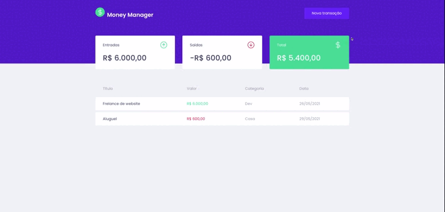

<div align="center">
<h1 >Money Manager</h1>

</div>

<h3 align="center">  
  <p align="center">
    <a href="#-sobre">Sobre</a>&nbsp;&nbsp;&nbsp;|&nbsp;&nbsp;&nbsp;
    <a href="#-tecnologias">Tecnologias</a>&nbsp;&nbsp;&nbsp;|&nbsp;&nbsp;&nbsp;
    <a href="#-como-executar">Como Executar</a>&nbsp;&nbsp;&nbsp;|&nbsp;&nbsp;&nbsp;
    <a href="#-licença">Licença</a>
  </p>
</h3>

## 📚 Sobre

O projeto tem como objetivo ajudar pessoas a fazerem o uso adequado da sua vida financeira, permitindo o controle das suas entradas e saídas 

## 🚀 Tecnologias utilizadas:

- ReactJS
- TypeScript
- Styled-Components
- NodeJs
- Axios
- MirageJs
- Polished

## ⏱ Como executar

```bash
# Clonar o repositório
$ git clone https://github.com/polyanetuag/moneymanager.git

# Entrar na pasta  
$ cd moneymanager

# Instalar as dependências
$ yarn 

# Iniciar o servidor
$ yarn start

# O servidor será inicializado em <http://localhost:3000>
```

## 📝 Licença

Esse projeto está sob a licença MIT.

---
Desenvolvido com 💜 por Polyane Tuag